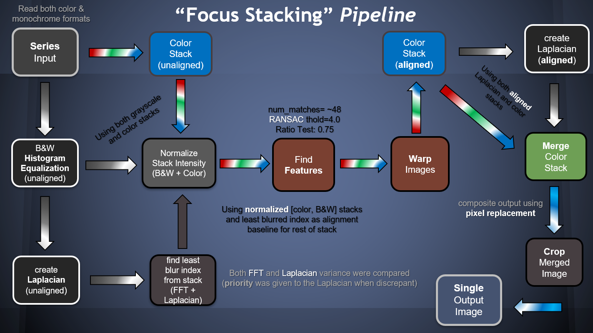
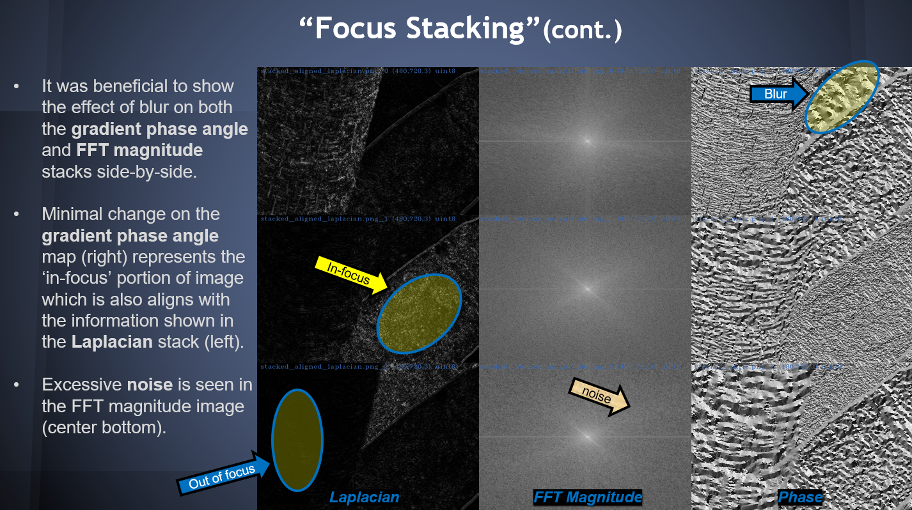
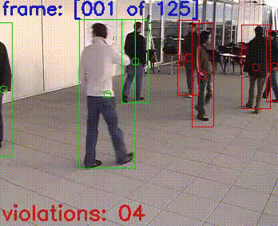
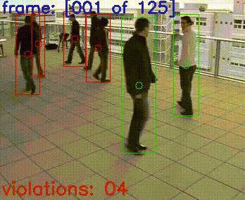
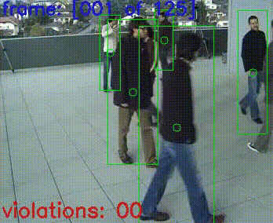
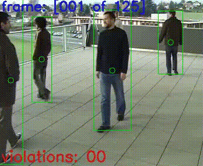

# computer_vision_py

[](https://opensource.org/licenses/Apache-2.0)

Collection of computer vision projects using OpenCV, numpy, etc.

## Example: [Focus-Depth Stacking](https://en.wikipedia.org/wiki/Focus_stacking)
### Composite Animation


### Pipeline


### Fast-Fourier Transform (FFT)



## Example: [Social Distancing](https://en.wikipedia.org/wiki/Social_distancing)
### camera0


### camera1


### camera2


### camera3



## Setup Python Virtual Environment
[Poetry Commands](https://python-poetry.org/docs/cli/)
```
# install 
curl -sSL https://raw.githubusercontent.com/python-poetry/poetry/master/get-poetry.py | python3 -
python get-poetry.py

# validate installed version
poetry --version

# optional: update configuration settings
poetry config virtualenvs.in-project true
poetry config experimental.new-installer false
poetry config --list

# create poetry.lock and create virtual python environment in .venv
poetry check
poetry install -vvv | tee ./app/logs/poetry_install.log

# update pip in .venv
poetry run python -m pip install --upgrade pip
```

## Setup Model Dependencies
```
curl -o ./yolo-coco/coco.names https://raw.githubusercontent.com/pjreddie/darknet/master/data/coco.names
curl -o ./yolo-coco/yolov3.cfg https://raw.githubusercontent.com/pjreddie/darknet/master/cfg/yolov3.cfg
curl -o ./yolo-coco/yolov3.weights https://pjreddie.com/media/files/yolov3.weights
```

## Documentaion
* [OpenCV Releases](https://github.com/opencv/opencv/releases)
* [OpenCV Documentation](https://docs.opencv.org/4.5.5/)
* [FFMPEG](https://ffmpeg.org)
* [Yolo](https://pjreddie.com/darknet/yolo/)


## Resources
* [Build OpenCV from source](https://drthitirat.wordpress.com/2019/01/20/opencv-python-build-opencv-4-0-1-dev-contrib-non-free-siftsurf-from-sources-on-windows-10-64-bit-os/)
* [SIFT/SURF in OpenCV 3](https://www.pyimagesearch.com/2015/07/16/where-did-sift-and-surf-go-in-opencv-3/)
* [CUDA Toolkit](https://developer.nvidia.com/cuda-downloads)
* [LAPACK](https://icl.cs.utk.edu/lapack-for-windows/lapack/#libraries_intel)
* [pyimagesearch](https://www.pyimagesearch.com/topics/)
* [CMake](https://cmake.org/download/)
* [Intel Performance Libraries](https://software.intel.com/content/www/us/en/develop/tools/performance-libraries.html)
* [ImageMagick binaries](https://imagemagick.org/script/download.php)


## Public Datasets
* [EPFL](https://www.epfl.ch/labs/cvlab/data/data-pom-index-php/)
* [CaltechPedestrians](http://www.vision.caltech.edu/Image_Datasets/CaltechPedestrians/)
